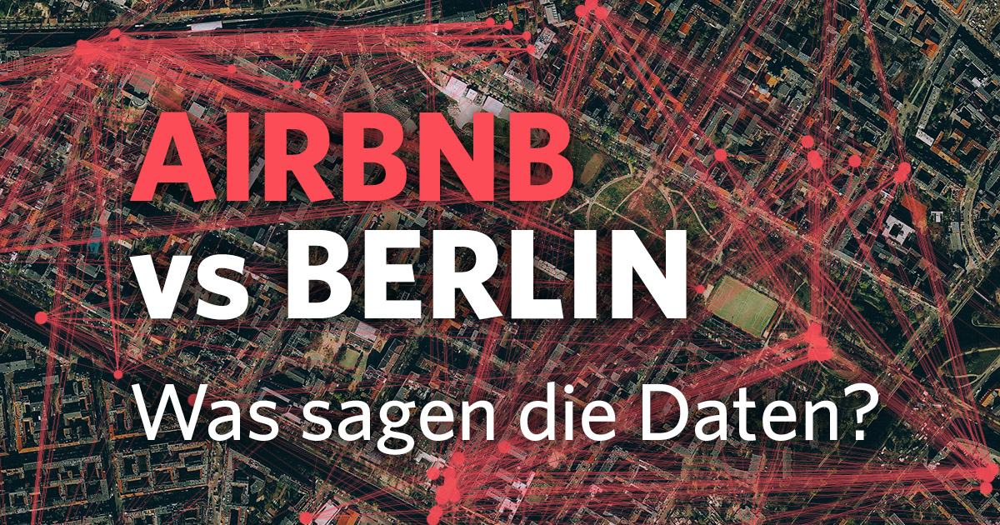

 
   

  

# Alexandre Wildt Graziani 
*Lead Data Scientist*

Airbnb hat erfolgreich die traditionelle Hotelbranche gestört, da immer mehr Reisende sich entscheiden, Airbnb als ihren Hauptunterkunftsanbieter zu nutzen. Seit seinem Beginn im Jahr 2008 hat Airbnb ein enormes Wachstum verzeichnet, wobei die Anzahl der auf seiner Website gelisteten Mietobjekte jedes Jahr exponentiell zunimmt. In Deutschland ist keine Stadt beliebter als Berlin. Das bedeutet, dass Berlin einer der heißesten Märkte für Airbnb in Europa ist, mit über 9060 Angeboten im Januar 2021.

# Analysis 

Das Ziel das Projekt ist eine explorative Datenanalyse (EDA) durchzuführen. Wir werden die ersten Einblick in der Daten erhalten, Muster identifizieren und Hypothesen aufstellen.
Die folgenden schritt werden in der Analyse durch durchgeführt

1. Data Laden 

2. Datenüberblick: Ersten Blick auf die Daten, um deren Struktur und Größe zu verstehen. Anzeigen der ersten Zeilen, Spaltennamen und Datentypen.

3. Datenbereinigung: Identifizieren und behandeln von fehlende Werte, Dubletten oder Ausreißer.

4. Deskriptive Statistiken: Berechnung grundlegender statistischer Maße wie Durchschnitt, Median, Standardabweichung und Quartile, um ein besseres Verständnis der Verteilung der Daten zu erhalten.
  
5. Datenvisualisierung: Erstellung vom Diagramme, Grafiken und Plots, um die Verteilung und Beziehungen zwischen den Variablen zu visualisieren.

6. Korrelationsanalyse: Untersuchung von Korrelationen zwischen verschiedenen Variablen, um festzustellen, ob starke Beziehungen vorhanden sind.

7. Hypothesenbildung: Auf der Grundlage von Beobachtungen und Analysen werden angenommen, wie verschiedene Faktoren miteinander in Beziehung stehen

* [Notebook](https://nbviewer.org/github/awildt01/Airbnb_Berlin-/blob/main/Analisando_os_Dados_do_Airbnb_%28Berlin_2%29.ipynb)

  

# Analysis 

We will uncover insights on:

+ Listings types: Airbnb original idea was to offer a room or a shared room within one's home. Is it still so?
+ Listings density: Are listings evenly spread across neighborhoods or are there hotspots?
+ Ownership: are properties owned by individual users or are there users with multiple rental properties (i.e. potentially for speculation)?
+ Price fairness: Are prices inflated for tourists? That is, is there a significative difference in prices between listings in English (i.e. for tourists) and German (i.e. "locals", or at least German-speaking tourists)? If there is, is this difference more pronounced in certain districts?
+ Trends and Seasonality: Since we do not have historic data about stays but only about reviews, we could use reviews as estimators of stays. Has the number of reviews increased over time? If it has, can we say that the increase is due to an increased number of visitors or it must be simply abscribed to an increment in the popularity of the platform? Is the flow of tourists seasonal, that is does it follow a seasonal trend? Can we explain the pattern?

**Background in:** Python, Machine Learning, Space Operations and Mathematical Optimisation.

**Links:**
* [Blog](https://sigmoidal.ai)
* [LinkedIn](https://www.linkedin.com/in/carlosfab)
* [Medium](https://medium.com/@alexandrewildtgraziani)

## Projetos:
Veja os tutoriais publicados do Sigmoidal:

* **Visualisierung von Daten aus der Fußball-Bundesliga 2011-2012:** https://epb.bibl.th-koeln.de/frontdoor/index/index/docId/992
* **Como Implementar Regressão Linear com Python:** https://bit.ly/2Li5pzY
* **Data Science: Investigando o naufrágio do Titanic:** https://bit.ly/2Ubr5SH
* **Como Tratar Dados Ausentes com Pandas:** https://bit.ly/31KWSMN
* **XGBoost: aprenda este algoritmo de Machine Learning em Python:** https://bit.ly/2UbRhws
* **Como criar uma Wordcloud em Python:** https://bit.ly/2OxsphM
* **Como lidar com dados desbalanceados:** https://bit.ly/2ZlaNsV

---
